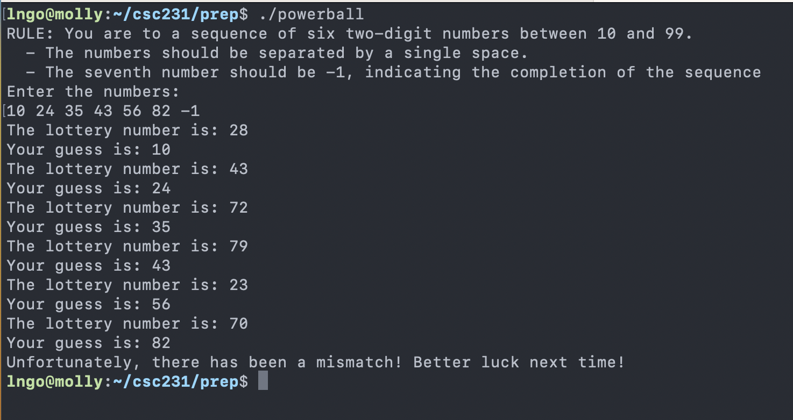
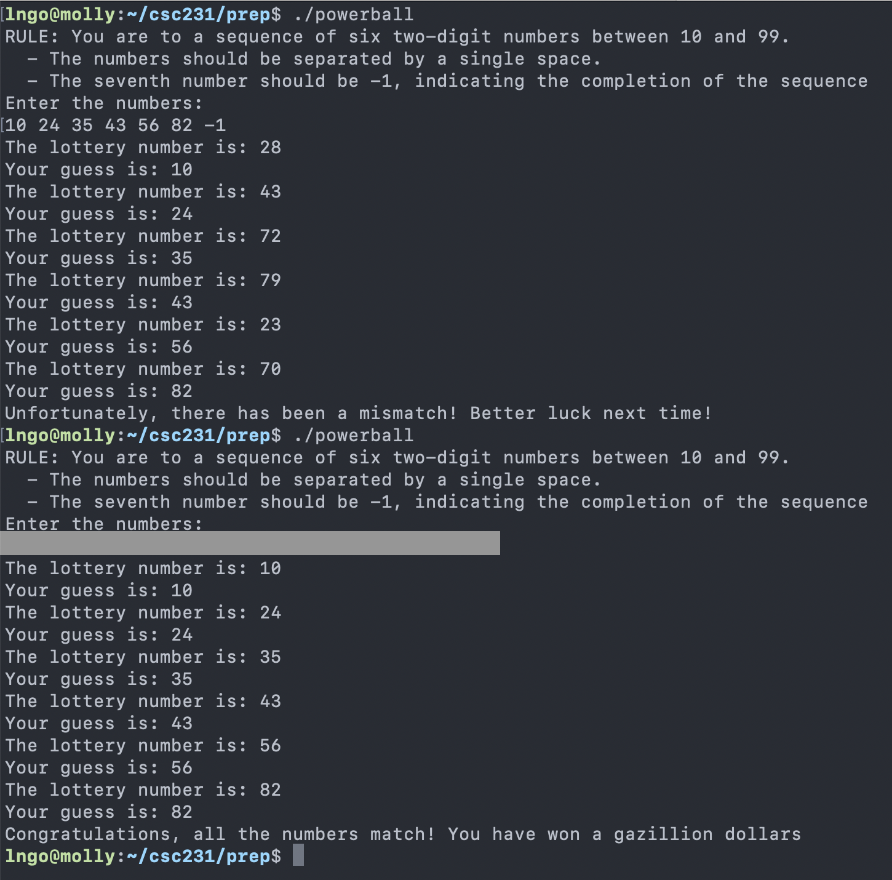

# Lab 3: Buffer Overflow

## Student Name: Brian Giovinazzo

## Instructions:

The U.S Powerball lottery for November 7 was won by some Californian for two billion dollars. While contemplating about the 
changes of winning such a lottery, you have been abducted by aliens and entered into a lottery game. Winning this game will 
reward you with one gazillion dollars, while failing this game will cause you to forfeit your life. You have exactly one 
chance to play. 

By accident, you have stumbled upon the source code of the game. For some mysterious reason, these highly advanced aliens  
still use C to program their devices, and the content of the powerball code (called **powerball.c**) is as follows:

```c
#include <stdio.h>
#include <stdlib.h>

int main(int argc, char *argv[]) {
  int entry[6];
  int results[6];
  int i = 0, tmp = 0;

  /* Generate power balls */                                                                   
  srand(0);                                                                         
  for (int i = 0; i < 6; i++) {                                                       
    results[i] = rand() % 99;                                                           
  }


  printf("RULE: You are to enter a sequence of six two-digit numbers between 10 and 99. \n");
  printf("  - The numbers should be separated by a single space. \n");
  printf("  - The seventh number should be -1, indicating the completion of the sequence \n");
  printf("Enter the numbers: \n");
  while(tmp != -1) {
    scanf("%d", &tmp);
    if (tmp == -1) break;
    entry[i] = tmp;
    i++; 
  }

  /* Check results */
  int match = 0;
  for (int i = 0; i < 6; i++) {
    printf("The lottery number is: %d\n", results[i]);
    printf("Your guess is: %d\n", entry[i]);
    if (results[i] == entry[i]) {
      match++;
    }
  }

  if (match != 6){
    printf("Unfortunately, there has been a mismatch! Better luck next time!\n");
  }
  else {
    printf("Congratulations, all the numbers match! You have won a gazillion dollars \n");
  }
  return 0;
}
```
  
After reading the source code, you realize that this code has a glaring bug that could be exploited. Armed with 
this knowledge, you enter the game, win the lottery, and return to Earth a gazillionaire. Now in your 100s, you 
are sitting down and writing this lab report to explain your success. 

### Task 1: Compile and run the lottery program

- Create the **powerball.c** program in molly using the source code above. 
- Compile and run **powerball.c** using the following syntax:

~~~bash
$ gcc -g -o powerball powerball.c
~~~

- Take a screenshot demonstrating the successful creation and execution of **powerball.c**
- Example:




### Task 2: Identify vulnerability

- User `gdb` to analyze the binary file **powerball**. 
- Identify the memory address of the arrays of integers contain a player's guesses and the game's correct numbers. 
- Take a screenshot showing the addresses of at least three consecutive elements in these arrays. 
- Answer the following questions:
  - Which array is likely to grow into the other should out-of-bound indices are accessed?

### Task 3: Perform the exploit

- Write a short paragraph describing your exploit and provide a screenshot demonstrating the success of your exploit. 
- The figure below shows only the successful outcome with the exploit details hidden



## Submission requirements

- Adjust your terminal windows so that it can display as much components of gdb-peda as possible. 
At a minimum, the C instructions to be executed next, gdb instructions, and any values as specified 
by the lab requirements above should clearly displayed in the screenshots.
- All screenshots (2 in total) and answers to question (2 questions in total) should be placed on a single PDF document 
in the correct cronological order of the lab instructions.
- The single PDF document added to your lab Github repository.
